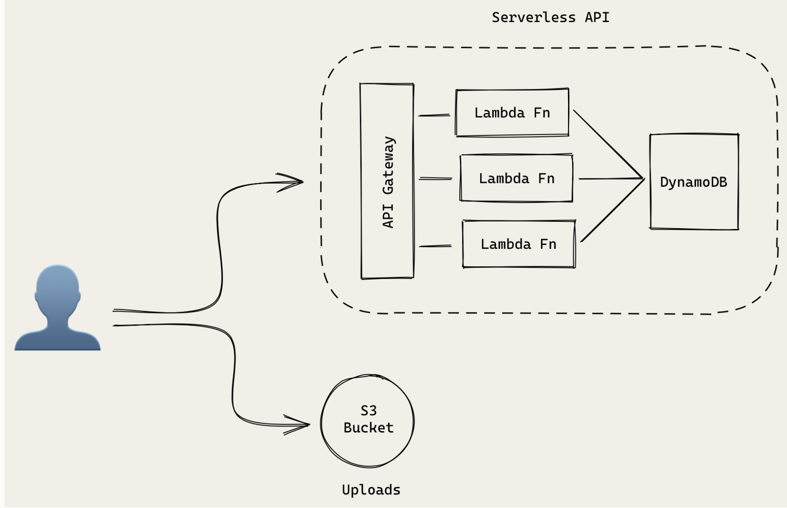
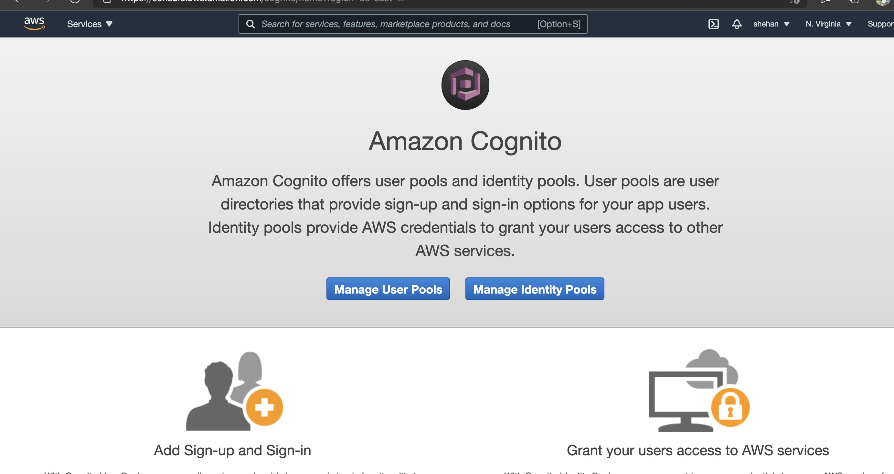
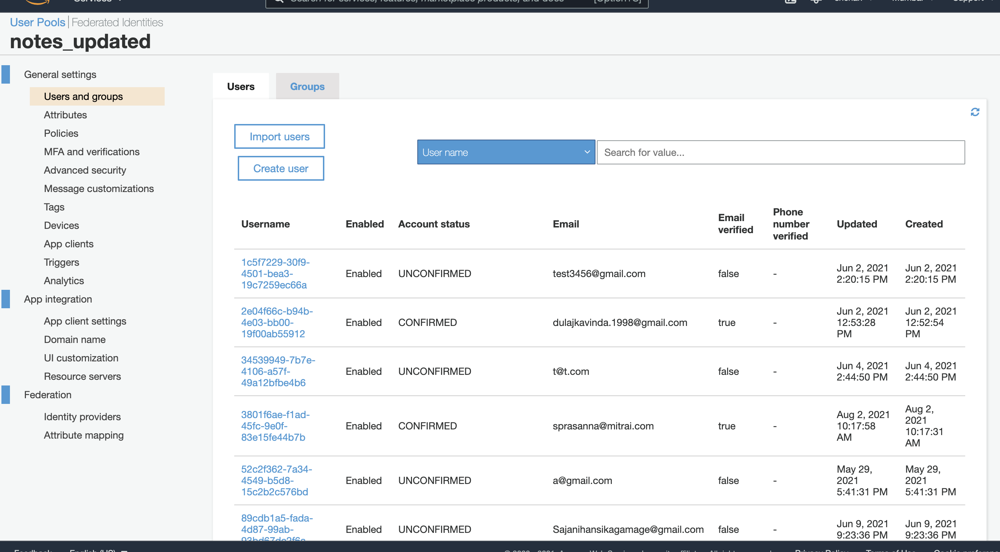
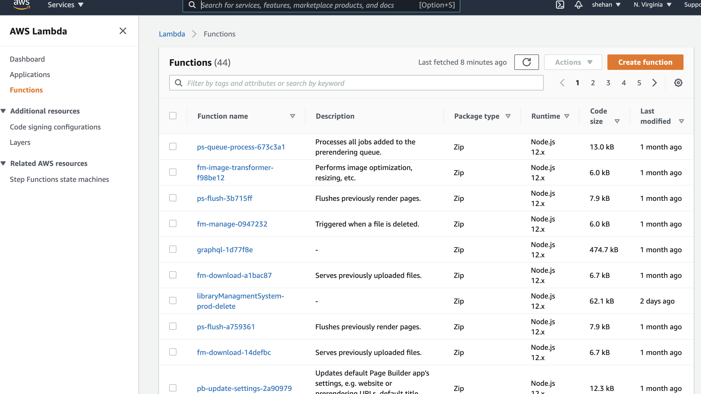
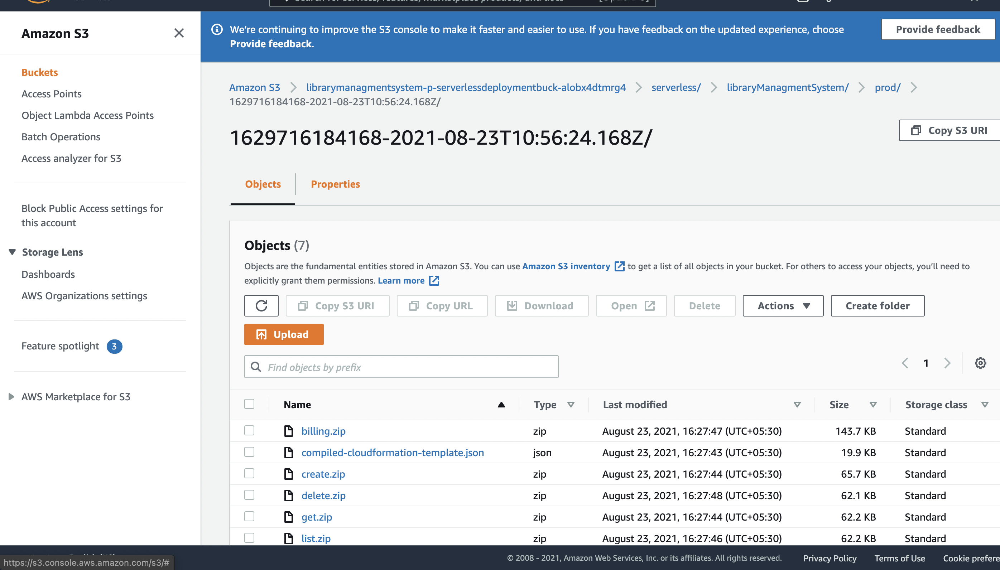
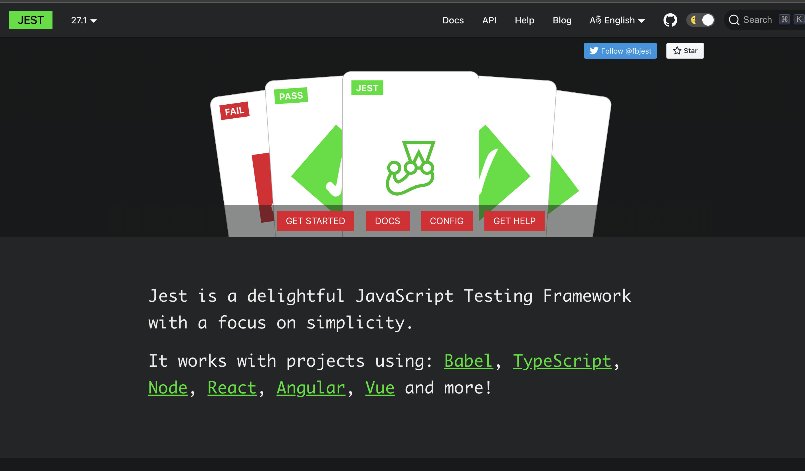
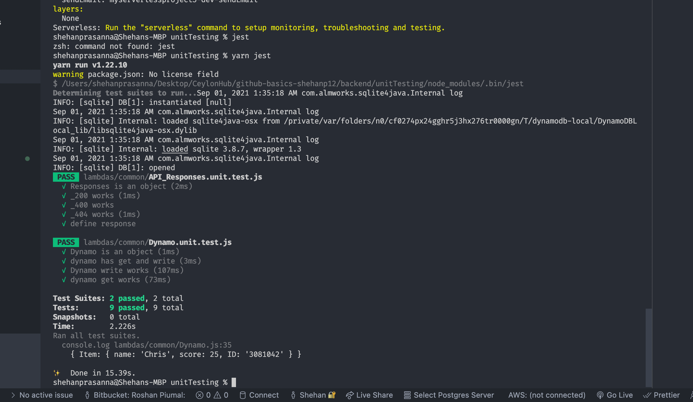

# Test login credentials: 
# Email: sprasanna@mitrai.com
# Passsword: Tripleh@123
# :wave: Library Management System!

This is a Full Stack app with React  with Material Ui and NodeJs  with **Serverless Stack Framework**  connected to AWS Server and DynamoDB database .
 
 # Video Url 
 https://drive.google.com/file/d/1gmHTrqm_FWoSvWCgh-ejnbZYLK76fIU3/view?usp=sharing

# 📒 The Technology Stack 
 1. React  
 2. Material Ui
 3. Amplify
 4. AWS Cognito
 5. AWS S3 Bucket
 6. Stripe Payment Gateway
 7.  Nodejs
 8. Serverless  Framework
 9. DynamoDB

# 🔏  Trello

1. Library Management  Backend
https://trello.com/invite/b/9J6rfLzG/6da229bf971d4ed439de340f44608eb7/library-managment-system-backend

2. Library Management  Frontend

# 🖥️   The App  Architecture

# 📙   AWS ScreenShots

1. Cognito User Pool 

  
2. AWS Lambda 

3. S3 Bucket

# 📙   Unit Testing

* I have used Jest with Serverlets Framework to test my backend functionalities.

## 📚  Resources 
* [React](https://www.youtube.com/watch?v=w3jLJU7DT5E&feature=youtu.be) 
* [Git and GitHub learning resources](https://docs.github.com/en/github/getting-started-with-github/git-and-github-learning-resources) 
* [Understanding the GitHub flow](https://guides.github.com/introduction/flow/)
* [How to use GitHub branches](https://www.youtube.com/watch?v=H5GJfcp3p4Q&feature=youtu.be)
* [Interactive Git training materials](https://githubtraining.github.io/training-manual/#/01_getting_ready_for_class)
* [GitHub's Learning Lab](https://lab.github.com/)
* [Education community forum](https://education.github.community/)
* [GitHub community forum](https://github.community/)
